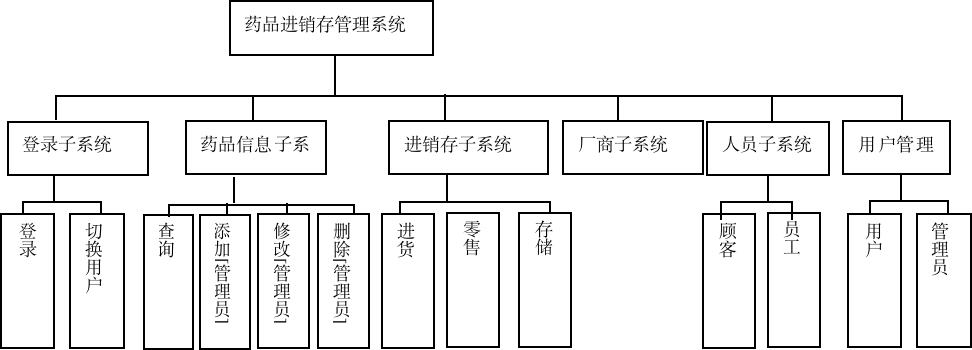
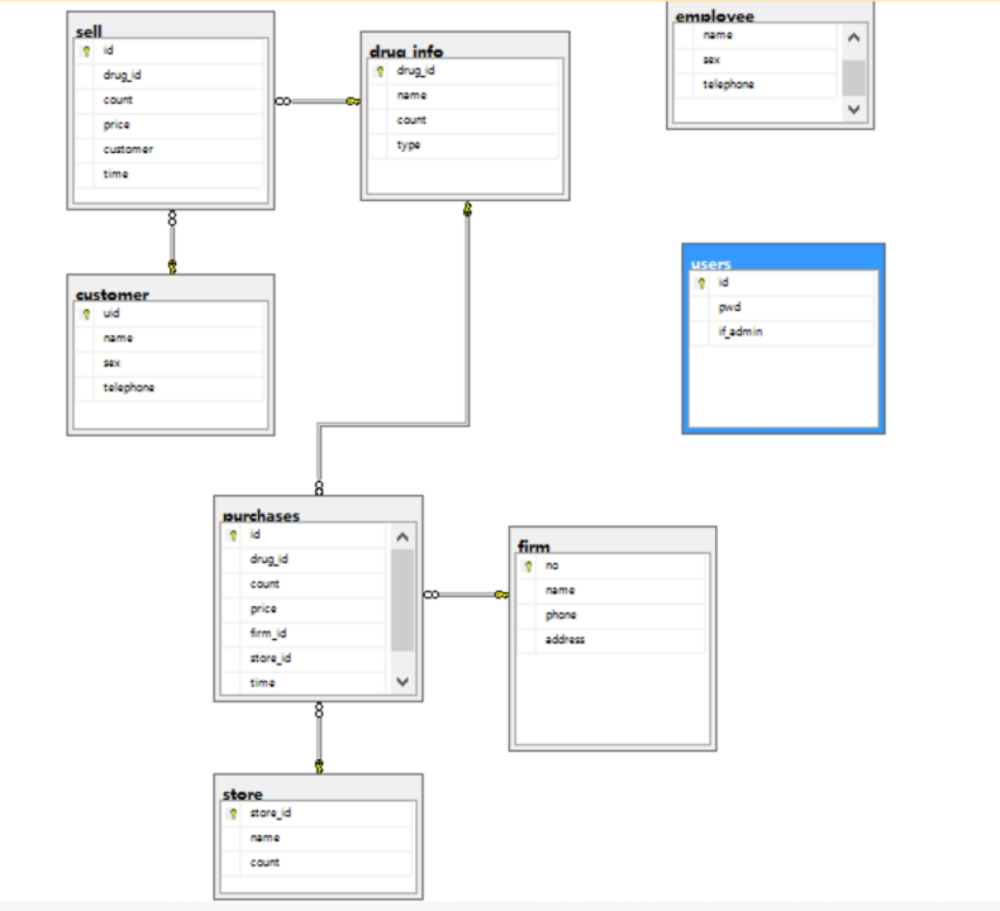
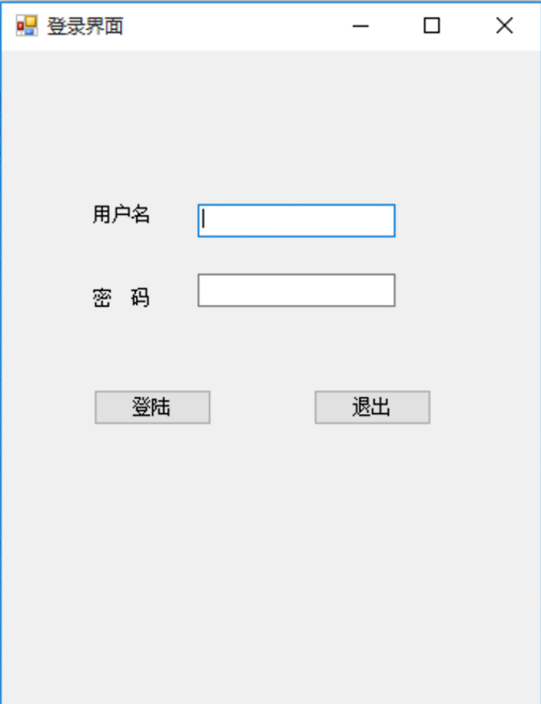
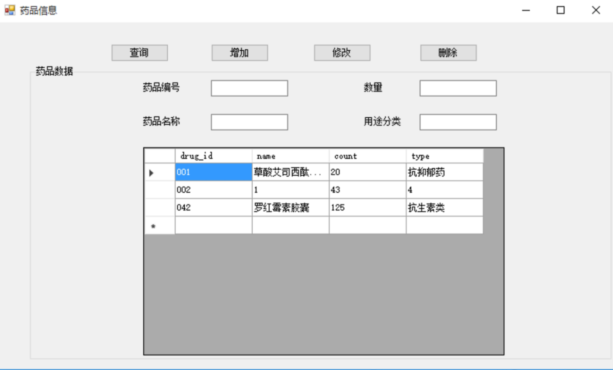
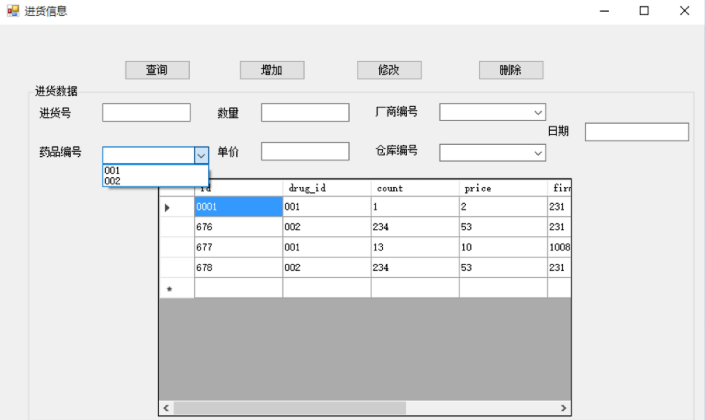
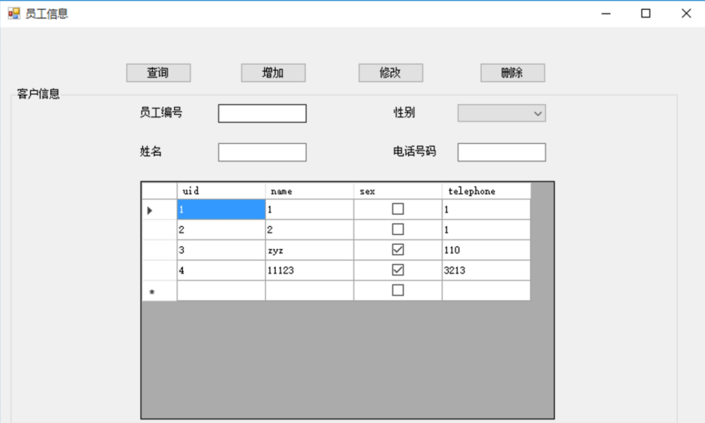

# 1 绪论

## 1.1 选题背景

近年来，面临新冠疫情等诸多挑战，医学领域愈发受到重视。在此期间，如何更好地管理药品成了相关领域企业里常见的需求。以前的人工管理方式已经不再适应现在的环境，取而代之的是先进的药品进销存管理系统，提高了药品进销存的工作效率，大大降低了处理药物的人力、财力。

## 1.2选题意义

药品进销存管理系统在药品的采购、入库、销售过程中，尤其是当下疫情期间，发挥了重要作用，它使得企业对药品的处理更加便利快捷，提供了优质的服务，大大简化了繁冗的工作，降低了药物管理成本。我们开发药品进销存管理系统就是采用现代化的信息管理方式代替手工管理方式，让药品能够更好、更高效地为医院、社会服务。

# 2 需求分析

## 2.1可行性分析

### 2.1.1**技术可行性**

就技术力量来说，可以完成此次开发工作，开发过程较为简单。目前掌握了mssql的操作方法，熟悉php语言，对网络技术和计算机组成原理有一定了解，具备独立编写数据库系统的能力。

### 2.1.2**经济可行性**

目标系统开发需求较低，开发周期较短，比较简单，开发难度不大。该系统的开发在一定程度上为使用者提供了便利，降低了人工管理的成本，在将来通过优化能进一步提高系统性能，带来更大便利。

### 2.1.3**管理可行性**

整个系统组成并不复杂，由个人独立开发，便于使用，因此操作管理难度不大。

## 2.2系统目标

药品进销存管理系统作为比较经典的信息管理系统，在开发阶段需在前后端两部分共同进行。其中，前端部分主要负责开发页面，将数据显示在界面上，后端部分主要负责数据库系统的建立及维护等工作。前者强调界面要人性化、要易于使用，而后者要求数据要有条理，便于维护。该系统开发需要注意信息系统化、规范化和自动化，要求系统能够稳定、长期运行，也要求系统要人性化、易于使用。

## 2.3 系统应该具备的功能

①员工基本信息的查询、修改，包括员工uid、员工姓名、员工性别、员工电话号码等。

②药品信息的查询、修改，包括id、名称、药品类别、药品数量。

③药品生产厂商的查询、修改，包括厂商编号、厂商名称、电话号码、地址。

④药品库存信息的查询、修改，包括仓库id、仓库名、药品数量。

⑤药品进货信息的查询、修改，包括日期、id、单价、数量、厂商编号、存放仓库id。

⑥药品零售信息的查询、修改，包括日期、id、单价、数量、客户id。

⑦客户基本信息的查询、修改，包括客户uid、客户姓名、客户性别、客户电话号码等。

⑧用户：能够查询药品信息、人员信息。

⑨管理员：能够查询、修改药品信息、人员信息、管理员信息。

## 2.4 系统结构图

（根据需求分析，药品进销存管理系统的结构图如下：)

 

# 3 概念设计

所要实现的功能设计，可能建立它们之间的关系，进而实现逻辑结构功能。药品进销存管理系统可以划分的实体有：药品信息实体、零售信息实体、客户信息实体、员工信息实体、进货信息实体等实体。



# 4 逻辑设计

(1)药品信息（药品编号，药品名称，药品数目，药品分类）

(2)顾客（顾客编号，顾客姓名，顾客性别，联系电话）

(3)员工(员工编号，员工姓名，员工性别，联系电话)

(4)用户(用户编号，用户密码，用户权限)

(5)厂商（厂商编号，厂商名称，厂商地址，联系电话）

(6)仓库（仓库编号，仓库名称，药品数量）

(7)进货（进货号，进货时间，药品编号，进货量，进货单价，厂商编号,仓库编号）

(8)零售（零售号，零售时间，药品编号，零售量，零售单价，顾客编号）

# 5 数据库物理设计

把概念的模型转换为实际的数据库能够支称的逻辑的数据模型就是所谓的设计逻辑结构，然后将该逻辑结构设计成对应的表结构。综上情况分析，要8张数据实表才能达到系统所有的功能，它们依次为：药品信息表、客户表、员工表表、管理用户表、进货表、零售表、仓库表、厂商表。具体如下表所展现。

**建库、建表、添加测试数据命令（脚本命令，可直接导入）：**

```mssql
CREATE DATABASE drug
GO

USE [drug]
GO
/****** Object:  Table [dbo].[customer]    Script Date: 2022/6/25 14:01:37 ******/
SET ANSI_NULLS ON
GO
SET QUOTED_IDENTIFIER ON
GO
SET ANSI_PADDING ON
GO
CREATE TABLE [dbo].[customer](
	[uid] [varchar](20) NOT NULL,
	[name] [varchar](20) NOT NULL,
	[sex] [bit] NOT NULL,
	[telephone] [varchar](20) NOT NULL,
 CONSTRAINT [PK_customer] PRIMARY KEY CLUSTERED 
(
	[uid] ASC
)WITH (PAD_INDEX = OFF, STATISTICS_NORECOMPUTE = OFF, IGNORE_DUP_KEY = OFF, ALLOW_ROW_LOCKS = ON, ALLOW_PAGE_LOCKS = ON) ON [PRIMARY]
) ON [PRIMARY]

GO
SET ANSI_PADDING OFF
GO
/****** Object:  Table [dbo].[drug_info]    Script Date: 2022/6/25 14:01:37 ******/
SET ANSI_NULLS ON
GO
SET QUOTED_IDENTIFIER ON
GO
SET ANSI_PADDING ON
GO
CREATE TABLE [dbo].[drug_info](
	[drug_id] [varchar](20) NOT NULL,
	[name] [varchar](20) NOT NULL,
	[count] [int] NOT NULL,
	[type] [varchar](20) NOT NULL,
 CONSTRAINT [PK_drug_info] PRIMARY KEY CLUSTERED 
(
	[drug_id] ASC
)WITH (PAD_INDEX = OFF, STATISTICS_NORECOMPUTE = OFF, IGNORE_DUP_KEY = OFF, ALLOW_ROW_LOCKS = ON, ALLOW_PAGE_LOCKS = ON) ON [PRIMARY]
) ON [PRIMARY]

GO
SET ANSI_PADDING OFF
GO
/****** Object:  Table [dbo].[employee]    Script Date: 2022/6/25 14:01:37 ******/
SET ANSI_NULLS ON
GO
SET QUOTED_IDENTIFIER ON
GO
SET ANSI_PADDING ON
GO
CREATE TABLE [dbo].[employee](
	[uid] [varchar](20) NOT NULL,
	[name] [varchar](20) NOT NULL,
	[sex] [bit] NOT NULL,
	[telephone] [varchar](20) NULL,
 CONSTRAINT [PK_employee] PRIMARY KEY CLUSTERED 
(
	[uid] ASC
)WITH (PAD_INDEX = OFF, STATISTICS_NORECOMPUTE = OFF, IGNORE_DUP_KEY = OFF, ALLOW_ROW_LOCKS = ON, ALLOW_PAGE_LOCKS = ON) ON [PRIMARY]
) ON [PRIMARY]

GO
SET ANSI_PADDING OFF
GO
/****** Object:  Table [dbo].[firm]    Script Date: 2022/6/25 14:01:37 ******/
SET ANSI_NULLS ON
GO
SET QUOTED_IDENTIFIER ON
GO
SET ANSI_PADDING ON
GO
CREATE TABLE [dbo].[firm](
	[no] [varchar](20) NOT NULL,
	[name] [varchar](20) NOT NULL,
	[phone] [varchar](20) NOT NULL,
	[address] [varchar](40) NOT NULL,
 CONSTRAINT [PK_firm] PRIMARY KEY CLUSTERED 
(
	[no] ASC
)WITH (PAD_INDEX = OFF, STATISTICS_NORECOMPUTE = OFF, IGNORE_DUP_KEY = OFF, ALLOW_ROW_LOCKS = ON, ALLOW_PAGE_LOCKS = ON) ON [PRIMARY]
) ON [PRIMARY]

GO
SET ANSI_PADDING OFF
GO
/****** Object:  Table [dbo].[purchases]    Script Date: 2022/6/25 14:01:37 ******/
SET ANSI_NULLS ON
GO
SET QUOTED_IDENTIFIER ON
GO
SET ANSI_PADDING ON
GO
CREATE TABLE [dbo].[purchases](
	[id] [varchar](20) NOT NULL,
	[drug_id] [varchar](20) NOT NULL,
	[count] [int] NOT NULL,
	[price] [int] NOT NULL,
	[firm_id] [varchar](20) NOT NULL,
	[store_id] [varchar](20) NOT NULL,
	[time] [datetime] NOT NULL,
 CONSTRAINT [PK_purchases] PRIMARY KEY CLUSTERED 
(
	[id] ASC
)WITH (PAD_INDEX = OFF, STATISTICS_NORECOMPUTE = OFF, IGNORE_DUP_KEY = OFF, ALLOW_ROW_LOCKS = ON, ALLOW_PAGE_LOCKS = ON) ON [PRIMARY]
) ON [PRIMARY]

GO
SET ANSI_PADDING OFF
GO
/****** Object:  Table [dbo].[sell]    Script Date: 2022/6/25 14:01:37 ******/
SET ANSI_NULLS ON
GO
SET QUOTED_IDENTIFIER ON
GO
SET ANSI_PADDING ON
GO
CREATE TABLE [dbo].[sell](
	[id] [varchar](20) NOT NULL,
	[drug_id] [varchar](20) NOT NULL,
	[count] [int] NOT NULL,
	[price] [int] NOT NULL,
	[customer] [varchar](20) NOT NULL,
	[time] [datetime] NOT NULL,
 CONSTRAINT [PK_sell] PRIMARY KEY CLUSTERED 
(
	[id] ASC
)WITH (PAD_INDEX = OFF, STATISTICS_NORECOMPUTE = OFF, IGNORE_DUP_KEY = OFF, ALLOW_ROW_LOCKS = ON, ALLOW_PAGE_LOCKS = ON) ON [PRIMARY]
) ON [PRIMARY]

GO
SET ANSI_PADDING OFF
GO
/****** Object:  Table [dbo].[store]    Script Date: 2022/6/25 14:01:37 ******/
SET ANSI_NULLS ON
GO
SET QUOTED_IDENTIFIER ON
GO
SET ANSI_PADDING ON
GO
CREATE TABLE [dbo].[store](
	[store_id] [varchar](20) NOT NULL,
	[name] [varchar](20) NOT NULL,
	[count] [int] NOT NULL,
 CONSTRAINT [PK_store_1] PRIMARY KEY CLUSTERED 
(
	[store_id] ASC
)WITH (PAD_INDEX = OFF, STATISTICS_NORECOMPUTE = OFF, IGNORE_DUP_KEY = OFF, ALLOW_ROW_LOCKS = ON, ALLOW_PAGE_LOCKS = ON) ON [PRIMARY]
) ON [PRIMARY]

GO
SET ANSI_PADDING OFF
GO
/****** Object:  Table [dbo].[users]    Script Date: 2022/6/25 14:01:37 ******/
SET ANSI_NULLS ON
GO
SET QUOTED_IDENTIFIER ON
GO
SET ANSI_PADDING ON
GO
CREATE TABLE [dbo].[users](
	[id] [varchar](20) NOT NULL,
	[pwd] [varchar](20) NOT NULL,
	[if_admin] [bit] NOT NULL,
 CONSTRAINT [PK_user] PRIMARY KEY CLUSTERED 
(
	[id] ASC
)WITH (PAD_INDEX = OFF, STATISTICS_NORECOMPUTE = OFF, IGNORE_DUP_KEY = OFF, ALLOW_ROW_LOCKS = ON, ALLOW_PAGE_LOCKS = ON) ON [PRIMARY]
) ON [PRIMARY]

GO
SET ANSI_PADDING OFF
GO
INSERT [dbo].[customer] ([uid], [name], [sex], [telephone]) VALUES (N'1', N'2', 0, N'3')
INSERT [dbo].[customer] ([uid], [name], [sex], [telephone]) VALUES (N'2', N'cj', 0, N'110')
INSERT [dbo].[customer] ([uid], [name], [sex], [telephone]) VALUES (N'3', N'cj', 1, N'110')
INSERT [dbo].[customer] ([uid], [name], [sex], [telephone]) VALUES (N'4', N'ddx', 1, N'119')
INSERT [dbo].[drug_info] ([drug_id], [name], [count], [type]) VALUES (N'001', N'草酸艾司西酞普兰片', 20, N'抗抑郁药')
INSERT [dbo].[drug_info] ([drug_id], [name], [count], [type]) VALUES (N'002', N'1', 43, N'4')
INSERT [dbo].[drug_info] ([drug_id], [name], [count], [type]) VALUES (N'042', N'
罗红霉素胶囊', 125, N'抗生素类')
INSERT [dbo].[employee] ([uid], [name], [sex], [telephone]) VALUES (N'1', N'1', 0, N'1')
INSERT [dbo].[employee] ([uid], [name], [sex], [telephone]) VALUES (N'2', N'2', 0, N'1')
INSERT [dbo].[employee] ([uid], [name], [sex], [telephone]) VALUES (N'3', N'zyz', 1, N'110')
INSERT [dbo].[employee] ([uid], [name], [sex], [telephone]) VALUES (N'4', N'11123', 1, N'3213')
INSERT [dbo].[firm] ([no], [name], [phone], [address]) VALUES (N'10086', N'某供应商', N'18300000002', N'上海浦东')
INSERT [dbo].[firm] ([no], [name], [phone], [address]) VALUES (N'231', N'黄云', N'110', N'黄河边')
INSERT [dbo].[firm] ([no], [name], [phone], [address]) VALUES (N'289', N'星途', N'17299998888', N'浙江招商')
INSERT [dbo].[purchases] ([id], [drug_id], [count], [price], [firm_id], [store_id], [time]) VALUES (N'0001', N'001', 1, 2, N'231', N'101', CAST(N'1998-01-01 01:02:03.000' AS DateTime))
INSERT [dbo].[purchases] ([id], [drug_id], [count], [price], [firm_id], [store_id], [time]) VALUES (N'676', N'002', 234, 53, N'231', N'123123', CAST(N'2021-01-03 00:00:00.000' AS DateTime))
INSERT [dbo].[purchases] ([id], [drug_id], [count], [price], [firm_id], [store_id], [time]) VALUES (N'677', N'001', 13, 10, N'10086', N'123123', CAST(N'2021-01-03 00:20:12.000' AS DateTime))
INSERT [dbo].[purchases] ([id], [drug_id], [count], [price], [firm_id], [store_id], [time]) VALUES (N'678', N'002', 234, 53, N'231', N'123123', CAST(N'2021-01-03 00:20:12.000' AS DateTime))
INSERT [dbo].[store] ([store_id], [name], [count]) VALUES (N'101', N'beg', 1000)
INSERT [dbo].[store] ([store_id], [name], [count]) VALUES (N'123123', N'', 0)
INSERT [dbo].[store] ([store_id], [name], [count]) VALUES (N'301', N'新场库', 2902)
INSERT [dbo].[users] ([id], [pwd], [if_admin]) VALUES (N'1', N'1', 0)
INSERT [dbo].[users] ([id], [pwd], [if_admin]) VALUES (N'2', N'2', 0)
INSERT [dbo].[users] ([id], [pwd], [if_admin]) VALUES (N'admin', N'admin', 1)
ALTER TABLE [dbo].[purchases]  WITH CHECK ADD  CONSTRAINT [FK_purchases_drug_info] FOREIGN KEY([drug_id])
REFERENCES [dbo].[drug_info] ([drug_id])
GO
ALTER TABLE [dbo].[purchases] CHECK CONSTRAINT [FK_purchases_drug_info]
GO
ALTER TABLE [dbo].[purchases]  WITH CHECK ADD  CONSTRAINT [FK_purchases_firm] FOREIGN KEY([firm_id])
REFERENCES [dbo].[firm] ([no])
GO
ALTER TABLE [dbo].[purchases] CHECK CONSTRAINT [FK_purchases_firm]
GO
ALTER TABLE [dbo].[purchases]  WITH CHECK ADD  CONSTRAINT [FK_purchases_store] FOREIGN KEY([store_id])
REFERENCES [dbo].[store] ([store_id])
GO
ALTER TABLE [dbo].[purchases] CHECK CONSTRAINT [FK_purchases_store]
GO
ALTER TABLE [dbo].[sell]  WITH CHECK ADD  CONSTRAINT [FK_sell_customer] FOREIGN KEY([customer])
REFERENCES [dbo].[customer] ([uid])
GO
ALTER TABLE [dbo].[sell] CHECK CONSTRAINT [FK_sell_customer]
GO
ALTER TABLE [dbo].[sell]  WITH CHECK ADD  CONSTRAINT [FK_sell_drug_info] FOREIGN KEY([drug_id])
REFERENCES [dbo].[drug_info] ([drug_id])
GO
ALTER TABLE [dbo].[sell] CHECK CONSTRAINT [FK_sell_drug_info]
GO
/****** Object:  StoredProcedure [dbo].[GetCID]    Script Date: 2022/6/25 14:01:37 ******/
SET ANSI_NULLS ON
GO
SET QUOTED_IDENTIFIER ON
GO
create procedure [dbo].[GetCID]
as 
select drug_id from drug_info 


GO
/****** Object:  StoredProcedure [dbo].[GetGID]    Script Date: 2022/6/25 14:01:37 ******/
SET ANSI_NULLS ON
GO
SET QUOTED_IDENTIFIER ON
GO
create procedure [dbo].[GetGID]
as 
select no from firm

GO
/****** Object:  StoredProcedure [dbo].[GetHID]    Script Date: 2022/6/25 14:01:37 ******/
SET ANSI_NULLS ON
GO
SET QUOTED_IDENTIFIER ON
GO
create procedure [dbo].[GetHID]
as 
select store_id from store

GO
/****** Object:  StoredProcedure [dbo].[GetTID]    Script Date: 2022/6/25 14:01:37 ******/
SET ANSI_NULLS ON
GO
SET QUOTED_IDENTIFIER ON
GO
create procedure [dbo].[GetTID]
as 
select uid from customer

GO
/****** Object:  StoredProcedure [dbo].[GetUID]    Script Date: 2022/6/25 14:01:37 ******/
SET ANSI_NULLS ON
GO
SET QUOTED_IDENTIFIER ON
GO
create procedure [dbo].[GetUID]
as
select id from users
GO
EXEC sys.sp_addextendedproperty @name=N'MS_Description', @value=N'0=man, 1=woman' , @level0type=N'SCHEMA',@level0name=N'dbo', @level1type=N'TABLE',@level1name=N'customer', @level2type=N'COLUMN',@level2name=N'sex'
GO
EXEC sys.sp_addextendedproperty @name=N'MS_Description', @value=N'0=man, 1=woman' , @level0type=N'SCHEMA',@level0name=N'dbo', @level1type=N'TABLE',@level1name=N'employee', @level2type=N'COLUMN',@level2name=N'sex'
GO
```

# 6 系统具体功能的实现

登录界面：

 

如果登陆用户为管理员，则可对数据库进行增删改查操作，且能增删改普通用户或管理员用户。如果登陆用户为普通用户，仅可对数据库进行查询，仅能看到数据库有哪些用户，且不能看到他们的密码。

下面以管理员身份登录（admin/admin）进行测试。

以管理员身份登陆后，主界面如下所示：

 

药品信息界面如下所示：

 

查询功能可模糊查询，只要包含所输入内容，即可查询到。

药品进货界面如下所示：

 

由于药品编号、厂商编号、仓库编号为外键，为了便于数据操作，这里选择下拉框以方便对编号进行选择。

员工信息界面如下所示：

 

其中，sex列中，打勾（1）意为女性，空（0）则意为男性。

主界面下，选择”切换用户”，则返回登陆界面。

# 7 程序运行方法

## 7.1 安装需求

1.编程软件：Microsoft Visual Studio系列；

2.数据库：Microsoft SQL Server。

## 7.2 编译连接：

1.数据库里建表，并建立数据源：

打开SQL Server 2014 Management Studio，登录，点击“文件”-“打开”-“文件”，选择此目录下的“数据库设计文件”-“data.sql”，导入脚本后，点击“执行”按钮，执行脚本；

2.在Microsoft Visual Studio 2017打开此目录“源程序”下的“药品进销存管理系统.sln”，修改Form.cs第35行（string str = "server=03BA;uid=sa;pwd=root;database=drug;";）为自己数据库的相关信息，编译后即可登录界面，与数据库建立连接。

## 7.3 注意事项：

1.如果数据库服务器版本不支持，尝试使用SQL Server 2008版本即可。

2.如果无法编译sln文件，将.NET Framework框架升级为4.6.2即可。

 

# 参考文献：

[1] 孙云寿，沈广元.高校学生宿舍文化建设探析.扬州大学学报(高教研究版)，2002.49-51.

[2] 宋明钧,方豪彪.高校学生公寓管理信息系统的应用.2007(03):12-14.

[3] J．M．Heller stein,M．Stonebreaker. Architecture of a Database System．Foundations and Trends in Databases,2007,(2):141-259.

[4] 耿新青，迟呈英．ORACLE与SQL SERVER语言的比较．鞍山钢铁学院学报，2012， 35(1)：36-39

[5] 萨师煊，王珊.《数据库系统概论》（第五版）.高等教育出版社,2002年2月.

